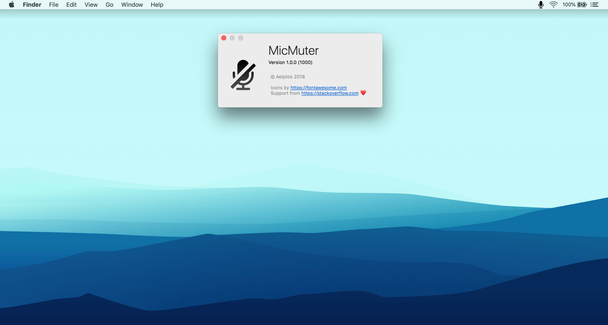

# MicMuter

## About

This small macOS app runs in the status bar and allows to quickly enable or disable the microphone sytem-wise.

Quitting the app can be done by right-clicking the icon and selecting _Quit_.

## Installation

To install, download the project, open in Xcode, archive and export app to the Desktop, then move the _.app_ to the Applications folder.

## Credits

* <https://fontawesome.com> for the icons
* <https://stackoverflow.com> for the support ❤️